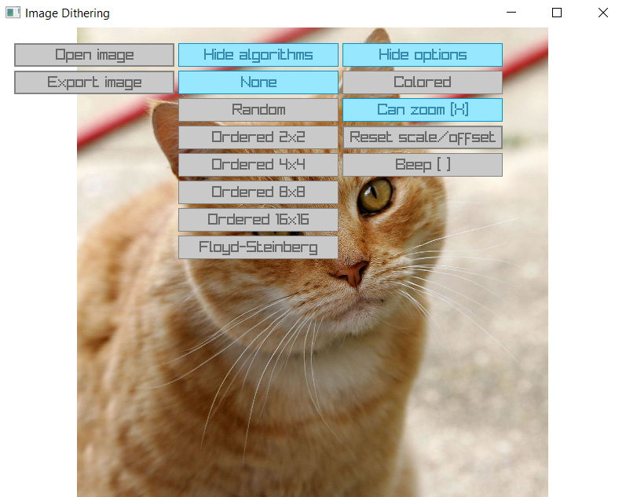
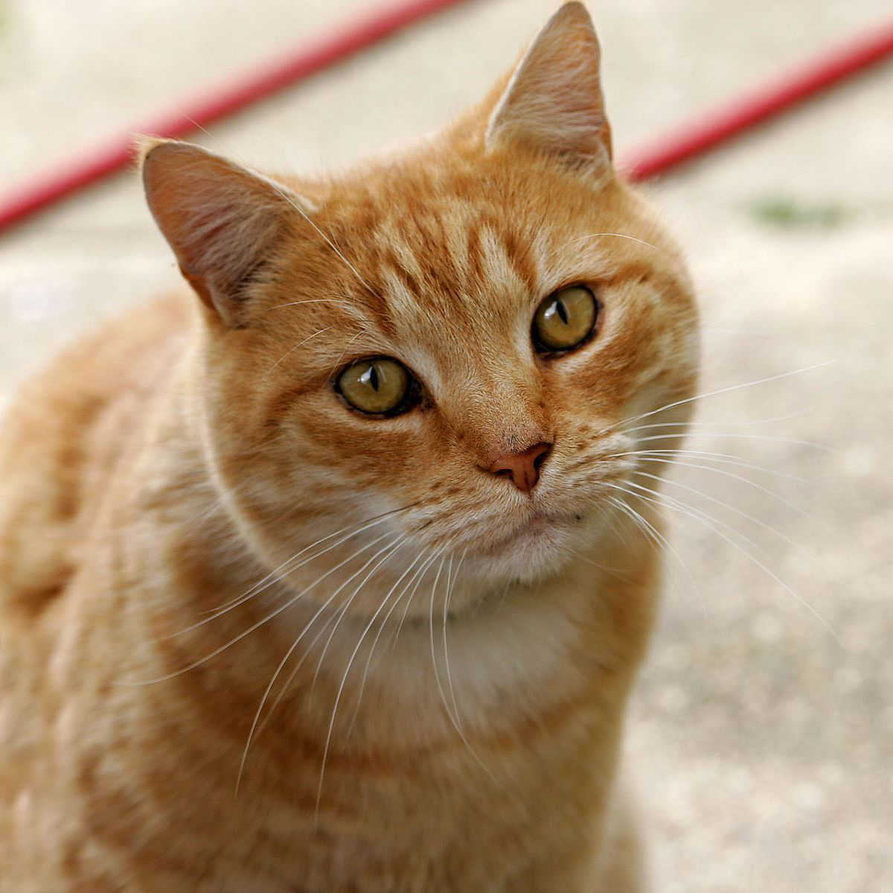
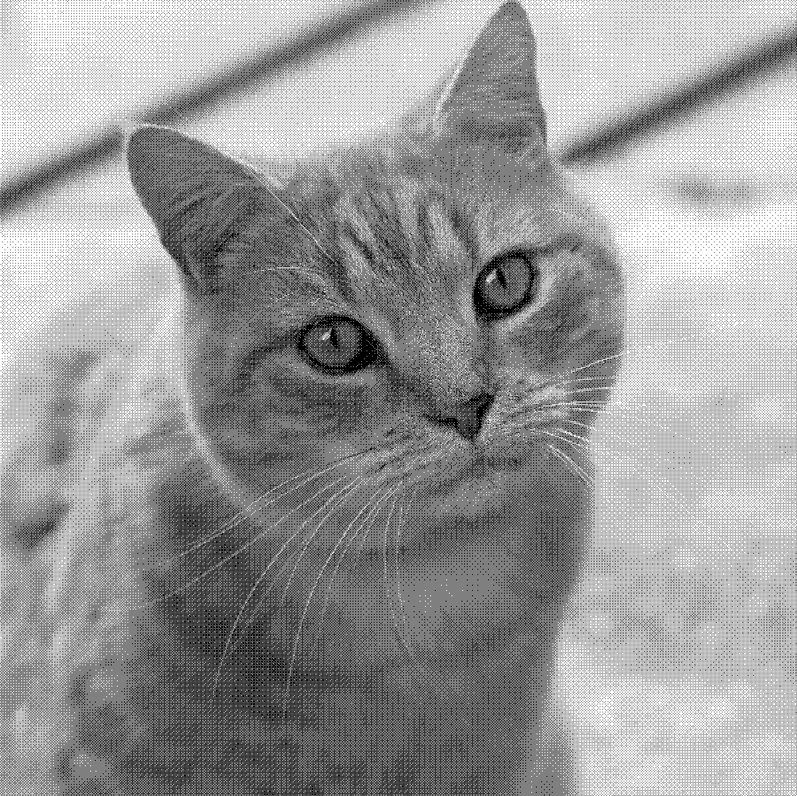
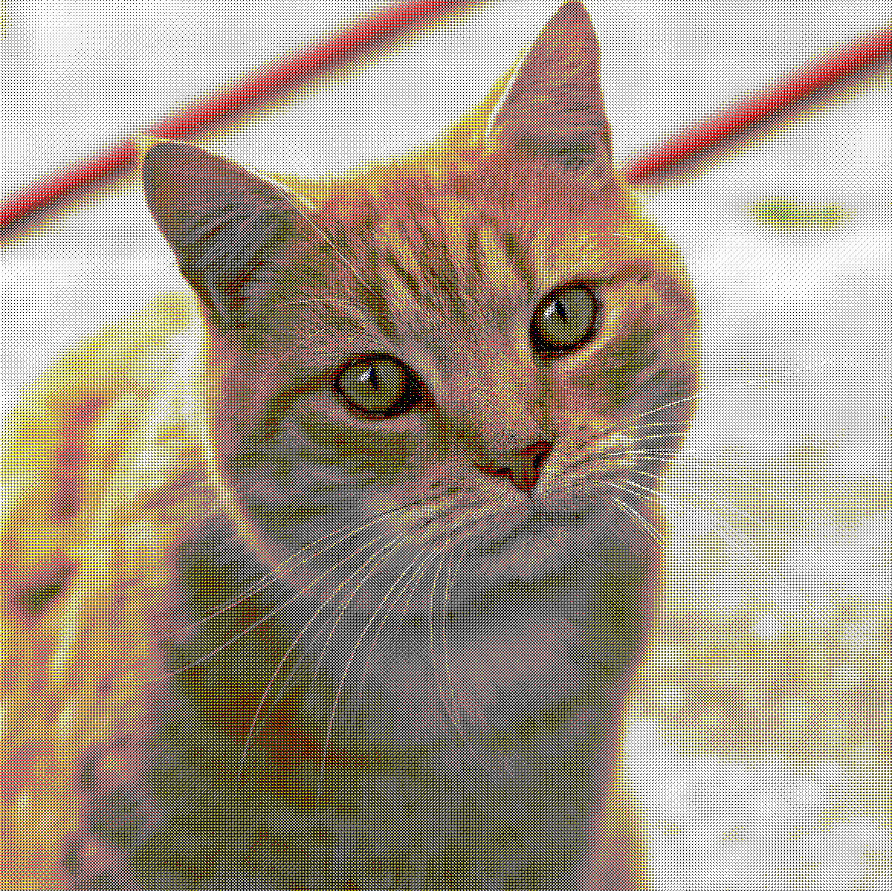
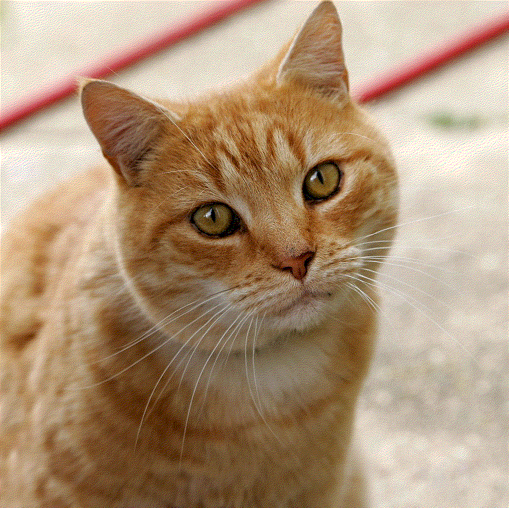

# ImageDithering
App that allows you to use different dithering algorithms to process images written in `C++`. Uses [`raylib`](https://www.raylib.com) for gui an image manipulation and [`CMake`](https://cmake.org) for building

## Features
- Three algorithms: Ordered (using a bayer matrix), Floyd-Steinberg and Random
- All algorithms can either by 1bit per pixel (black or white) or 1bit per chanel (1bit for red, green and blue)
- Uses native dialog windows for handeling file operations (using [`tiny file dialogs`](https://sourceforge.net/projects/tinyfiledialogs/))
- Images can be dropped on to the window to load them
- Image can be inspected with zoom and pan
- Images can be processed in a batch by supplying the paths as the program arguments (and a .txt file which describes what parameters to use. First number is the number of the algorithm to use, those are the same as their order in the application, the second number 0 if you want black and white images and 1 if you want them to be in color)

## Examples
Your browser probably filters those images, so for the best result you should download them and view them in a app that doesn't filter images (eg. paint.net)
### Input image

### Ordered dithering (8x8 matrix)

### Floyd-Steinberd dithering

## Usage
- Clone the source and compile it using `CMake`
